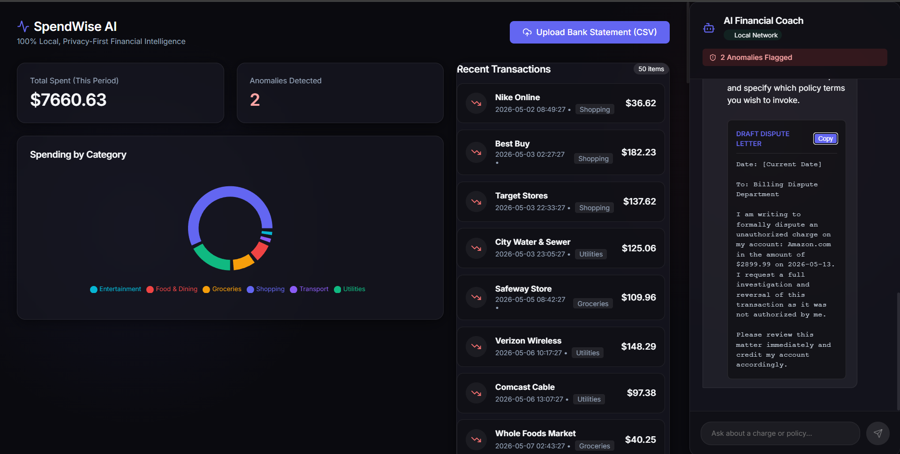
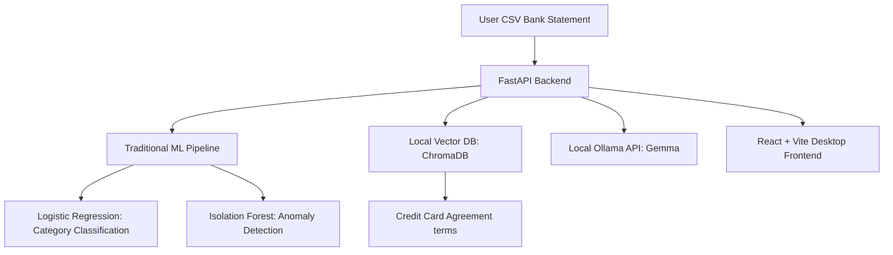

# SpendWise AI 🛡️💼

<p align="center">
  <strong>100% Local, Privacy-First Personal Financial Intelligence Platform</strong>
</p>

<p align="center">
  <a href="#"></a>
  <a href="#"></a>
  <a href="#"></a>
  <a href="#"></a>
  <a href="#"></a>
</p>

<p align="center">
  
</p>

---

SpendWise AI is a hybrid AI-powered financial dashboard designed to analyze bank statements completely offline. It integrates traditional Machine Learning (Supervised text classification + Unsupervised anomaly detection), Retrieval-Augmented Generation (RAG), and a local LLM agent to classify transactions, flag suspicious charges, and draft formal dispute letters grounded in cardholder policy agreements.

No data ever leaves your computer. No cloud APIs, no subscription fees, and complete data sovereignty.

---

## 🏛️ System Architecture



1. **Supervised ML:** Runs TF-IDF vectorization and Logistic Regression to categorize transaction descriptions.
2. **Unsupervised ML:** Runs an Isolation Forest to score and isolate unusual transaction amounts.
3. **Local Vector Search (RAG):** Splices and indexes credit card terms into a local ChromaDB store using `all-MiniLM-L6-v2` sentence embeddings.
4. **Agentic Copilot:** Orchestrates data from the ML engine and the vector database to guide the user, explain flags, and auto-draft formal dispute letters.

---

## ✨ Features

- **Automated Expense Categorization:** Instant Scikit-Learn predictions for raw merchant descriptions.
- **Isolation Forest Anomaly Alerting:** Flags transactions that statistically deviate from normal spending habits.
- **Local RAG Integration:** Semantically retrieves policy terms directly from cardholder agreements (e.g., dispute windows, liability terms).
- **Copilot Chat Interface:** Side-by-side local LLM chat engine powered by Ollama to answer financial queries.
- **Auto-Draft Dispute Letters:** Generates formal, policy-grounded letters citing exact transaction IDs and contract clauses.
- **Premium Glassmorphic UI:** Modern dark-mode React interface with interactive charts (Recharts) and responsive layouts.
- **Token-by-Token Streaming:** Real-time word-by-word response loading using Server-Sent Events (SSE).

---

## 🛠️ Technology Stack

| Component | Technology |
| :--- | :--- |
| **Frontend UI** | React, Vite, Recharts, Lucide Icons, Vanilla CSS |
| **Backend API** | FastAPI, Uvicorn, Pydantic |
| **Machine Learning**| Scikit-Learn, Pandas, NumPy, Joblib |
| **Vector DB / RAG** | ChromaDB, Sentence-Transformers (`all-MiniLM-L6-v2`) |
| **Local LLM** | Ollama (`gemma4:e2b` or custom fine-tune) |

---

## 📂 Project Structure

```bash
├── backend/
│   ├── data/                    # Sample CSV statements & Credit Card policies
│   ├── models/                  # Saved .joblib model weights (git-ignored)
│   ├── chromadb/                # Local persistent vector database (git-ignored)
│   ├── ml_engine.py             # Supervised/Unsupervised training & test script
│   ├── rag_engine.py            # Documents chunking & ChromaDB indexing script
│   ├── agent_engine.py          # Ollama orchestrator and prompt builder
│   ├── main.py                  # FastAPI server and endpoints
│   └── requirements.txt         # Python dependencies
├── frontend/
│   ├── src/                     # React components, style sheets, and main entry
│   ├── package.json             # NPM package scripts & configuration
│   └── vite.config.js           # Vite dev server configuration
└── README.md                    # Project documentation
```

---

## 🚀 Quick Start Guide

### Prerequisites
- **Python 3.10+**
- **Node.js 18+**
- **Ollama** installed on your system.

### 1. Setup the Backend
1. Navigate to the backend directory:
   ```bash
   cd backend
   ```
2. Install dependencies:
   ```bash
   pip install -r requirements.txt
   ```
3. Generate mock transactions and train the machine learning models:
   ```bash
   python ml_engine.py
   ```
4. Parse and index the credit card terms document into the Vector Store (ChromaDB):
   ```bash
   python rag_engine.py
   ```
5. Start the FastAPI server:
   ```bash
   python main.py
   ```
   The backend will start running on `http://127.0.0.1:8000`.

### 2. Setup the Local LLM
1. Start Ollama on your computer.
2. Pull the target model (we recommend `gemma4:e2b` or any compatible model):
   ```bash
   ollama pull gemma4:e2b
   ```
   *(Note: If you use a custom model name, you can update `MODEL_NAME` in `backend/agent_engine.py` to match your pulled model)*.

### 3. Setup the Frontend
1. Open a new terminal window and navigate to the frontend directory:
   ```bash
   cd frontend
   ```
2. Install npm packages:
   ```bash
   npm install
   ```
3. Start the Vite development server:
   ```bash
   npm run dev
   ```
   Open your browser and navigate to the URL shown in the terminal (usually `http://localhost:5173`).

---

## 🧪 Verification Flow

1. On the web dashboard, click **Upload Statement**.
2. Select `backend/data/transactions_test.csv`.
3. Check the transaction list for suspicious red anomaly items and review the category charts.
4. Click the sidebar chat and type: *"Draft a dispute letter for the crypto wire transfer charge."*
5. The local model will generate a formal PDF-ready letter citing the card agreement clauses retrieved from ChromaDB.

---

## 🔮 Future Agentic Roadmap (Next Steps)

To transition SpendWise AI from a local chat dashboard into a fully autonomous financial agent, the following architectural additions are planned:

### 1. Tool Call Architecture (ReAct Loop)
Integrating a structured **Thought ➔ Action ➔ Observation** reasoning loop, equipping the LLM with deterministic Python tools:
*   `calculate_dispute_window(transaction_date)`: A Python helper to accurately compute date delta offsets, preventing LLM date math hallucinations.
*   `search_internet(query)`: Hooking the agent to a search engine API (e.g. Tavily/Serper) to lookup merchant customer support contact emails and physical addresses when they are missing from the statement.
*   `flag_dispute_db(transaction_id)`: Writing to a local SQLite database to mark transactions as "Disputed" and save progress.

### 2. File Writing & Email Automation
*   `generate_pdf_letter(letter_text)`: Dynamically compilation of the AI dispute draft into a standard formal PDF document.
*   `send_dispute_email(pdf_path, banker_email)`: Hooking up SMTP or SendGrid APIs to automatically email the dispute packages to the bank's claims department once the user approves the preview.

### 3. SQLite DB & Memory Persistence
*   Integrating a local SQLite database using SQLAlchemy to persist uploaded statements, categorizations, and complete historical chat logs so data is not lost on server restarts.
